# AWS infrastructure for Kubernetes microservices

A hands-on, end-to-end DevOps practice project: AWS infrastructure provisioned with Terraform, three FastAPI microservices containerized with Docker, packaged with Helm, deployed to Amazon EKS, wired into a full CI/CD pipeline with GitHub Actions (OIDC) and Argo CD (GitOps), observed with Prometheus + Grafana, and hardened with Kubernetes Secrets, Network Policies, and an internet-facing Ingress via the AWS Load Balancer Controller.
 
This README documents the full history of the project (Phases 1-5), including the exact commands used at each step, so it can be rebuilt from scratch or used as a reference.
 
## Project status
 
| Phase | Status | Contents |
|---|---|---|
| **Phase 1 — Infrastructure** | Complete | VPC, ECR, EKS, RDS, remote S3+DynamoDB backend, GitHub OIDC |
| **Phase 2 — Applications** | Complete | 3 microservices (FastAPI), multi-stage Docker, Helm charts |
| **Phase 3 — CI/CD and GitOps** | Complete | GitHub Actions (OIDC) + Argo CD with auto-sync and self-heal |
| **Phase 4 — Observability** | Complete | kube-prometheus-stack (Prometheus + Grafana), app-level metrics |
| **Phase 5 — Security** | Complete | Kubernetes Secrets + real RDS connection, Network Policies, ALB Ingress |
 
## Architecture

```mermaid
flowchart TB
    developer[Developer]
    internet[Internet]
    github[GitHub Repo]
    actions[GitHub Actions CI]
    ecr[(Amazon ECR)]
    argocd[Argo CD]
    backend[(S3: Terraform State)]
    lock[(DynamoDB: State Lock)]
 
    subgraph aws[AWS us-east-1]
        alb[Application Load Balancer]
 
        subgraph network[VPC dev 10.0.0.0/16]
            igw[Internet Gateway]
            public1[Public subnet 1 - us-east-1a]
            public2[Public subnet 2 - us-east-1b]
            nat[NAT Gateway]
            private1[Private subnet 1 - us-east-1a]
            private2[Private subnet 2 - us-east-1b]
 
            subgraph eks[EKS Cluster dev-eks-cluster]
                albctrl[AWS Load Balancer Controller]
                nodes[Managed Node Group t3.small]
                subgraph nsdev[namespace dev - NetworkPolicy default-deny + allow rules]
                    ingress[Ingress microservices-ingress]
                    users[users-service pod]
                    orders[orders-service pod]
                    products[products-service pod]
                    secret[(Secret: rds-credentials)]
                end
                subgraph nsargo[namespace argocd]
                    argocdsrv[Argo CD controller]
                end
                subgraph nsmon[namespace monitoring]
                    prom[Prometheus]
                    graf[Grafana]
                end
            end
 
            rds[(RDS PostgreSQL 16.3 - private)]
        end
    end
 
    developer -->|git push| github
    github -->|trigger| actions
    actions -->|OIDC AssumeRole, no static credentials| ecr
    actions -->|updates tag in values.yaml and commits| github
    argocdsrv -.->|poll every 3 min| github
    argocdsrv -->|sync / self-heal| users
    argocdsrv -->|sync / self-heal| orders
    argocdsrv -->|sync / self-heal| products
    argocdsrv -->|sync / self-heal| ingress
    nodes -.->|docker pull| ecr
    secret -.->|envFrom| users
    secret -.->|envFrom| orders
    secret -.->|envFrom| products
    users -->|5432, allowed by NetworkPolicy| rds
    orders -->|5432, allowed by NetworkPolicy| rds
    products -->|5432, allowed by NetworkPolicy| rds
    prom -.->|scrape /metrics every 15s, allowed by NetworkPolicy| users
    prom -.->|scrape /metrics every 15s, allowed by NetworkPolicy| orders
    prom -.->|scrape /metrics every 15s, allowed by NetworkPolicy| products
    graf -->|query| prom
    internet -->|HTTP :80| alb
    alb -->|IP target mode| ingress
    ingress --> users
    ingress --> orders
    ingress --> products
    albctrl -.->|manages via IRSA| alb
    public1 --> igw
    public2 --> igw
    public1 --> nat
    private1 --> nat
    private2 --> nat
    developer --> backend
    developer --> lock
```
 

 
### CI/CD and GitOps flow
 
The CI pipeline never touches the cluster directly:
 
1. Code push to `apps/<service>/` on the `master` branch.
2. GitHub Actions authenticates to AWS via OIDC (no static credentials), builds the Docker image, pushes it to ECR tagged with `github.sha`, updates the corresponding `values.yaml`, and commits that change back to the repo.
3. Argo CD, running inside the EKS cluster, detects the change in Git and pulls the new version into the `dev` namespace.
4. Auto-sync + self-heal: any manual drift on the cluster is detected and reverted automatically.
```
git push (code)
   -> GitHub Actions: build + push to ECR (auth via OIDC)
   -> GitHub Actions: update values.yaml + commit
   -> Argo CD detects the change in Git
   -> Argo CD deploys to EKS (dev namespace)
```
 
### Public access
 
```
Internet -> Application Load Balancer (HTTP :80) -> Ingress -> Service -> Pod
```
 
The ALB is provisioned and managed automatically by the AWS Load Balancer Controller running inside the cluster, driven by a single `Ingress` resource that path-routes to each microservice (`/users`, `/orders`, `/products`).
 
---
 
## Phase 1 — Infrastructure (Terraform)
 
### Repository layout for Terraform
 
```
terraform/
├── environments/
│   └── dev/
│       ├── backend.tf
│       ├── main.tf
│       ├── outputs.tf
│       └── variables.tf
└── modules/
    ├── vpc/
    ├── ecr/
    ├── eks/
    ├── rds/
    ├── github-oidc/
    └── alb-controller/
```
 
### VPC module
 
VPC `10.0.0.0/16`, two public and two private subnets across `us-east-1a`/`us-east-1b`, one Internet Gateway, one NAT Gateway (single-AZ, cost decision), public/private route tables. Exposes `vpc_id`, `public_subnets_ids`, `private_subnets_ids`.
 
### ECR module
 
Three repositories created with `for_each`, one per microservice (`users-service`, `orders-service`, `products-service`), with `image_tag_mutability = "IMMUTABLE"` and `scan_on_push = true`.
 
### EKS module
 
- Two IAM roles: one for the control plane (`AmazonEKSClusterPolicy`) and one for the node group (`AmazonEKSWorkerNodePolicy`, `AmazonEKS_CNI_Policy`, `AmazonEC2ContainerRegistryReadOnly`).
- Cluster `dev-eks-cluster`, Kubernetes version `1.30`.
- Managed node group, instance type `t3.small` (upgraded from `t3.micro`; on `t3.micro` the pods-per-ENI limit made Argo CD's pods get stuck `Pending`), `desired_size = 3`, `min = 1`, `max = 4`.
- Exposes `cluster_oidc_issuer_url`, needed by the `alb-controller` module for IRSA.
### RDS module
 
DB subnet group + security group (port `5432` only from the VPC CIDR) + `aws_db_instance` PostgreSQL `16.3`, `db.t3.micro`, 20 GiB `gp3`, `publicly_accessible = false`, `skip_final_snapshot = true` (fine for a lab, not for production). Database name: `app_db`.
 
### github-oidc module
 
Creates an `aws_iam_openid_connect_provider` trusting `token.actions.githubusercontent.com`, and an `aws_iam_role` that GitHub Actions can assume via `AssumeRoleWithWebIdentity`, scoped to this specific repository. Only grants ECR push permissions (least privilege — this role can never touch EKS, RDS, or VPC).
 
Important lesson learned: GitHub's OIDC `sub` claim format includes immutable numeric IDs, and changes shape when the job specifies a GitHub Environment. The trust condition must match the real format, for example:
 
```
repo:<github-username>@<user-id>/<repo-name>@<repo-id>:environment:dev
```
 
You can inspect the real value your workflow receives by temporarily adding a debug step that fetches and decodes the OIDC token (see "Troubleshooting notes" below).
 
### alb-controller module (IRSA for the AWS Load Balancer Controller)
 
Creates a **second, separate** OIDC provider — this one trusts the EKS cluster's own OIDC issuer (not GitHub), which is what lets pods inside the cluster assume AWS IAM roles without static credentials (a pattern called IRSA — IAM Roles for Service Accounts).
 
- `data "tls_certificate"` fetches the cluster's real OIDC certificate to compute its thumbprint dynamically (unlike GitHub's OIDC, which uses a fixed public thumbprint).
- The IAM policy is the official one published by the `aws-load-balancer-controller` project, downloaded and stored as `alb-controller-policy.json` next to the module, and loaded with `file("${path.module}/alb-controller-policy.json")`.
- The IAM role's trust condition is scoped to a specific Kubernetes ServiceAccount:
```
  system:serviceaccount:kube-system:aws-load-balancer-controller
```
 
### Backend (remote state)
 
State lives in S3 with locking via DynamoDB. The bucket and table are **not** managed by Terraform (avoids the chicken-and-egg problem) and must be created manually first:
 
```bash
aws s3api create-bucket \
  --bucket my-project-tf-state-us-east-1 \
  --region us-east-1
 
aws s3api put-bucket-versioning \
  --bucket my-project-tf-state-us-east-1 \
  --versioning-configuration Status=Enabled
 
aws dynamodb create-table \
  --table-name terraform-ha-dev-locks \
  --attribute-definitions AttributeName=LockID,AttributeType=S \
  --key-schema AttributeName=LockID,KeyType=HASH \
  --billing-mode PAY_PER_REQUEST \
  --region us-east-1
```
 
`terraform/environments/dev/backend.tf`:
 
```hcl
terraform {
  backend "s3" {
    bucket         = "my-project-tf-state-us-east-1"
    key            = "dev/terraform.tfstate"
    region         = "us-east-1"
    dynamodb_table = "terraform-ha-dev-locks"
    encrypt        = true
  }
}
```
 
### Deploy the infrastructure
 
```bash
cd terraform/environments/dev
terraform init
terraform fmt -recursive ../../
terraform validate
terraform plan -var="db_password=REPLACE_WITH_A_SECRET"
terraform apply
```
 
`db_password` is a sensitive variable with no default on purpose — never hardcode it:
 
```bash
export TF_VAR_db_password="ReplaceWithASecureValue"
terraform plan
terraform apply
```
 
### Read outputs
 
```bash
terraform output
terraform output vpc_id
terraform output eks_cluster_endpoint
terraform output eks_cluster_oidc_issuer_url
terraform output ecr_repository_urls
terraform output rds_endpoint
terraform output alb_controller_role_arn
```
 
### Connect kubectl to the cluster
 
```bash
aws eks update-kubeconfig --region us-east-1 --name dev-eks-cluster
kubectl get nodes
```
 
Note: every time the cluster is destroyed and recreated, it gets a **new endpoint and a new OIDC issuer URL**, and this command must be run again or `kubectl` will fail with a DNS resolution error.
 
### Destroy the environment
 
```bash
cd terraform/environments/dev
terraform destroy
```
 
Warning: `terraform destroy` also deletes the ECR repositories, along with every image pushed to them. After recreating the infrastructure, all microservice images must be rebuilt and pushed again (or rely on the CI pipeline to do it). It also removes the ALB — the AWS Load Balancer Controller and the IRSA-based IAM roles will need to be recreated too, and the manually-created `ServiceAccount` and `Secret` (see Phase 5) must be recreated by hand, since they are not managed by Terraform or Helm.
 
### Terraform state lock troubleshooting
 
If a `plan`/`apply`/`destroy` is interrupted (closed terminal, lost connection), the state lock in DynamoDB can be left stuck:
 
```bash
terraform force-unlock <LOCK_ID>
```
 
The `<LOCK_ID>` is shown in the full error message when a locked operation is attempted.
 
---
 
## Phase 2 — Applications (Docker + Helm)
 
### Microservices
 
Three independent FastAPI services under `apps/`: `users-service`, `orders-service`, `products-service`. Each exposes `/`, `/health` (used by Kubernetes probes), `/metrics` (Prometheus, see Phase 4), and a domain endpoint (`/users`, `/orders`, `/products`) backed by real PostgreSQL data (see Phase 5).
 
Local run (optional, useful while developing):
 
```bash
cd apps/users-service
python -m venv venv
source venv/Scripts/activate   # Git Bash on Windows; venv/bin/activate on Linux/Mac
pip install -r requirements.txt
uvicorn app.main:app --reload --port 8000
```
 
### Dockerfile (multi-stage, non-root)
 
Each service has a Dockerfile with two stages: a `builder` stage that installs dependencies with `pip install --user`, and a slim runtime stage (`python:3.12-slim`) that copies only what's needed and runs as a non-root user.
 
Build and test locally:
 
```bash
cd apps/users-service
docker build -t users-service:local .
docker run -p 8000:8000 users-service:local
curl http://localhost:8000/
```
 
### Push an image to ECR manually (only needed outside of CI, e.g. right after recreating the infra)
 
```bash
aws ecr get-login-password --region us-east-1 | \
  docker login --username AWS --password-stdin <ACCOUNT_ID>.dkr.ecr.us-east-1.amazonaws.com
 
docker tag users-service:local <ACCOUNT_ID>.dkr.ecr.us-east-1.amazonaws.com/dev-users-service:v1
docker push <ACCOUNT_ID>.dkr.ecr.us-east-1.amazonaws.com/dev-users-service:v1
```
 
### Helm charts
 
An umbrella chart (`helm/microservices`) with one subchart per service, each containing a `Deployment` (image, replicas, resources, `livenessProbe`/`readinessProbe` against `/health`, `envFrom` pulling from the `rds-credentials` Secret) and a `ClusterIP` `Service`. Cluster-wide resources (Network Policies, the Ingress) live directly under `helm/microservices/templates/`, not inside a subchart, since they apply to the whole `dev` namespace rather than a single service.
 
Important detail learned the hard way: a `Service`'s `metadata.labels` and its `spec.selector` are two different things that happen to share the same key name (`app`). Prometheus' `ServiceMonitor` matches against `metadata.labels`, not `spec.selector`:
 
```yaml
apiVersion: v1
kind: Service
metadata:
  name: users-service
  labels:
    app: users-service      # required for ServiceMonitor discovery
spec:
  selector:
    app: users-service       # routes traffic to pods, unrelated to the label above
  ports:
    - name: http              # must be named for ServiceMonitor/Ingress to reference it
      port: 80
      targetPort: 8000
  type: ClusterIP
```
 
Manual Helm operations (not normally needed once Argo CD is managing the app — see Phase 3):
 
```bash
cd helm/microservices
helm dependency update
helm template .                 # render locally to check syntax, no cluster needed
helm install microservices . --namespace dev --create-namespace
helm upgrade microservices . -n dev
```
 
---
 
## Phase 3 — CI/CD and GitOps
 
### GitHub Actions workflows
 
One workflow per microservice under `.github/workflows/`, triggered on push to `master`/`feature/*` touching `apps/<service>/**`, or manually via `workflow_dispatch`. Each workflow:
 
1. Authenticates to AWS via OIDC using `aws-actions/configure-aws-credentials`, assuming the role stored in the `AWS_ROLE_ARN` secret (scoped to a GitHub **Environment** named `dev`, not a plain repository secret).
2. Builds and pushes the Docker image to ECR, tagged with `github.sha`.
3. Updates the image tag in the corresponding Helm `values.yaml`.
4. Commits and pushes that change back to `master` using the `github-actions[bot]` identity.
Required job permissions:
 
```yaml
permissions:
  contents: write   # needed because the workflow commits back to the repo
  id-token: write   # needed to request the OIDC token
```
 
### Argo CD
 
Installed inside the cluster, in its own namespace:
 
```bash
kubectl create namespace argocd
kubectl apply -n argocd -f https://raw.githubusercontent.com/argoproj/argo-cd/stable/manifests/install.yaml
kubectl get pods -n argocd
```
 
Access the UI:
 
```bash
kubectl port-forward svc/argocd-server -n argocd 8090:443
kubectl -n argocd get secret argocd-initial-admin-secret -o jsonpath="{.data.password}" | base64 -d
```
 
Open `https://localhost:8090` (user `admin`).
 
The `Application` resource is declarative and lives in Git (`argocd-apps/microservices-app.yaml`), pointing at `helm/microservices` on the `master` branch, with `syncPolicy.automated` (`prune` + `selfHeal`) enabled:
 
```bash
kubectl apply -f argocd-apps/microservices-app.yaml
kubectl get application microservices-app -n argocd
```
 
Force a manual sync instead of waiting for the ~3 minute poll interval:
 
```bash
kubectl patch application microservices-app -n argocd --type merge -p '{"operation": {"sync": {}}}'
```
 
(or use the **SYNC** button in the UI)
 
---
 
## Phase 4 — Observability (Prometheus + Grafana)
 
### Install kube-prometheus-stack
 
```bash
helm repo add prometheus-community https://prometheus-community.github.io/helm-charts
helm repo update
kubectl create namespace monitoring
 
helm install monitoring prometheus-community/kube-prometheus-stack \
  --namespace monitoring \
  --set prometheus.prometheusSpec.retention=6h \
  --set prometheus.prometheusSpec.resources.requests.memory=256Mi \
  --set prometheus.prometheusSpec.resources.limits.memory=512Mi \
  --set grafana.resources.requests.memory=128Mi \
  --set grafana.resources.limits.memory=256Mi \
  --set alertmanager.enabled=false
 
kubectl get pods -n monitoring
```
 
### Access Grafana and Prometheus
 
```bash
kubectl port-forward svc/monitoring-grafana -n monitoring 3000:80
kubectl get secret monitoring-grafana -n monitoring -o jsonpath="{.data.admin-password}" | base64 -d
```
 
```bash
kubectl port-forward svc/monitoring-kube-prometheus-prometheus -n monitoring 9090:9090
```
 
### Instrumenting the microservices
 
Each FastAPI app exposes `/metrics` using `prometheus-fastapi-instrumentator`. Every service needs both the code change and the dependency added individually to its own `requirements.txt` — they are independent codebases and nothing is shared automatically between them.
 
```python
from fastapi import FastAPI
from prometheus_fastapi_instrumentator import Instrumentator
 
app = FastAPI(title="Users Service")
Instrumentator().instrument(app).expose(app)
```
 
```
prometheus-fastapi-instrumentator==7.0.0
```
 
### ServiceMonitor per microservice
 
```yaml
apiVersion: monitoring.coreos.com/v1
kind: ServiceMonitor
metadata:
  name: users-service
  namespace: dev
  labels:
    release: monitoring   # must match the Helm release name of kube-prometheus-stack
spec:
  selector:
    matchLabels:
      app: users-service   # must match Service metadata.labels, not spec.selector
  endpoints:
    - port: http            # must match the named port in the Service
      path: /metrics
      interval: 15s
```
 
### Verifying that Prometheus is actually scraping the services
 
```bash
curl -s http://localhost:9090/api/v1/targets?state=active | grep -o '"job":"serviceMonitor/dev/[^"]*"'
curl -s http://localhost:9090/api/v1/targets?state=dropped | grep -o '"job":"serviceMonitor/dev/[^"]*"'
curl -s --data-urlencode 'query=http_requests_total{job=~"serviceMonitor/dev/.*"}' http://localhost:9090/api/v1/query
```
 
### Example query in Grafana Explore
 
```
rate(http_requests_total{job=~"serviceMonitor/dev/.*"}[5m])
```
 
---
 
## Phase 5 — Security
 
### 5.1 Kubernetes Secrets and a real RDS connection
 
The database password must never be committed to Git, including inside `values.yaml`. Instead, a Kubernetes `Secret` is created directly in the cluster, out of band:
 
```bash
terraform -chdir=terraform/environments/dev output rds_endpoint
 
kubectl create secret generic rds-credentials \
  --namespace dev \
  --from-literal=DB_HOST='<rds-endpoint>' \
  --from-literal=DB_PORT='5432' \
  --from-literal=DB_NAME='app_db' \
  --from-literal=DB_USER='dbadmin' \
  --from-literal=DB_PASSWORD='<the-real-password>'
 
kubectl describe secret rds-credentials -n dev   # shows key names and sizes, never values
```
 
Each microservice reads its connection string from environment variables and connects with SQLAlchemy + psycopg2, injected via `envFrom` in the Deployment:
 
```python
import os
from sqlalchemy import create_engine, text
 
DB_HOST = os.environ.get("DB_HOST")
DB_PORT = os.environ.get("DB_PORT", "5432")
DB_NAME = os.environ.get("DB_NAME")
DB_USER = os.environ.get("DB_USER")
DB_PASSWORD = os.environ.get("DB_PASSWORD")
 
engine = create_engine(
    f"postgresql://{DB_USER}:{DB_PASSWORD}@{DB_HOST}:{DB_PORT}/{DB_NAME}",
    pool_pre_ping=True,
)
```
 
```yaml
containers:
  - name: users-service
    envFrom:
      - secretRef:
          name: rds-credentials
```
 
`envFrom.secretRef` injects every key in the Secret as an environment variable in one shot. Each service owns its own table (`users`, `orders`, `products`) inside the shared `app_db` database, created automatically on startup via a `CREATE TABLE IF NOT EXISTS`.
 
Pods reference Secrets injected via `envFrom` only at container start — updating a Secret does not automatically restart pods that already have the old values loaded:
 
```bash
kubectl delete secret rds-credentials -n dev
kubectl create secret generic rds-credentials -n dev --from-literal=... # (recreate with corrected values)
kubectl rollout restart deployment users-service -n dev
kubectl rollout restart deployment orders-service -n dev
kubectl rollout restart deployment products-service -n dev
```
 
### 5.2 Network Policies (default-deny + explicit allow rules)
 
By default, Kubernetes allows all traffic between all pods in a cluster — nothing is isolated unless a `NetworkPolicy` says otherwise. A default-deny policy is applied to the `dev` namespace, then explicit exceptions are opened for the only traffic that should be allowed:
 
```yaml
# default-deny-all: blocks all ingress and egress for every pod in dev
apiVersion: networking.k8s.io/v1
kind: NetworkPolicy
metadata:
  name: default-deny-all
  namespace: dev
spec:
  podSelector: {}
  policyTypes:
    - Ingress
    - Egress
```
 
```yaml
# allow-dns: without this, pods can't resolve any hostname (including RDS's own endpoint)
apiVersion: networking.k8s.io/v1
kind: NetworkPolicy
metadata:
  name: allow-dns
  namespace: dev
spec:
  podSelector: {}
  policyTypes: [Egress]
  egress:
    - to: [{namespaceSelector: {}}]
      ports:
        - {protocol: UDP, port: 53}
        - {protocol: TCP, port: 53}
```
 
```yaml
# allow-rds-egress: RDS is outside the cluster, so it's matched by IP range (ipBlock), not by pod labels
apiVersion: networking.k8s.io/v1
kind: NetworkPolicy
metadata:
  name: allow-rds-egress
  namespace: dev
spec:
  podSelector: {}
  policyTypes: [Egress]
  egress:
    - to:
        - ipBlock: {cidr: 10.0.0.0/16}
      ports:
        - {protocol: TCP, port: 5432}
```
 
```yaml
# allow-prometheus-scrape: lets Prometheus (in the "monitoring" namespace) reach /metrics
apiVersion: networking.k8s.io/v1
kind: NetworkPolicy
metadata:
  name: allow-prometheus-scrape
  namespace: dev
spec:
  podSelector: {}
  policyTypes: [Ingress]
  ingress:
    - from:
        - namespaceSelector:
            matchLabels:
              kubernetes.io/metadata.name: monitoring
      ports:
        - {protocol: TCP, port: 8000}
```
 
`kubernetes.io/metadata.name` is a label Kubernetes adds automatically to every namespace with its own name, so no manual labeling is required.
 
Verify:
 
```bash
kubectl get networkpolicy -n dev
kubectl port-forward svc/users-service -n dev 8001:80
curl http://localhost:8001/users
```
 
### 5.3 Internet-facing Ingress via the AWS Load Balancer Controller
 
The "simple" option was chosen: HTTP only (no custom domain, no TLS certificate). In a real production setup this would be paired with a real domain and `cert-manager` + Let's Encrypt for HTTPS.
 
**Step 1 — IRSA setup (Terraform, `modules/alb-controller`)**: see Phase 1 above.
 
**Step 2 — Kubernetes ServiceAccount linked to the IAM role**:
 
```bash
kubectl create serviceaccount aws-load-balancer-controller -n kube-system
 
kubectl annotate serviceaccount aws-load-balancer-controller \
  -n kube-system \
  eks.amazonaws.com/role-arn=<alb_controller_role_arn output>
```
 
The ServiceAccount name and namespace must exactly match the trust condition set in the IAM role (`system:serviceaccount:kube-system:aws-load-balancer-controller`), the same pattern as the GitHub OIDC trust condition in Phase 1.
 
**Step 3 — Install the controller**:
 
```bash
helm repo add eks https://aws.github.io/eks-charts
helm repo update
 
helm install aws-load-balancer-controller eks/aws-load-balancer-controller \
  -n kube-system \
  --set clusterName=dev-eks-cluster \
  --set serviceAccount.create=false \
  --set serviceAccount.name=aws-load-balancer-controller \
  --set region=us-east-1 \
  --set vpcId=<vpc_id output>
 
kubectl get pods -n kube-system -l app.kubernetes.io/name=aws-load-balancer-controller
```
 
`serviceAccount.create=false` is required — the ServiceAccount was already created manually with the IRSA annotation in Step 2. If Helm created its own, it would lack that annotation and the controller could never authenticate to AWS.
 
**Step 4 — The Ingress resource** (`helm/microservices/templates/ingress.yaml`):
 
```yaml
apiVersion: networking.k8s.io/v1
kind: Ingress
metadata:
  name: microservices-ingress
  namespace: dev
  annotations:
    kubernetes.io/ingress.class: alb
    alb.ingress.kubernetes.io/scheme: internet-facing
    alb.ingress.kubernetes.io/target-type: ip
    alb.ingress.kubernetes.io/listen-ports: '[{"HTTP": 80}]'
spec:
  rules:
    - http:
        paths:
          - path: /users
            pathType: Prefix
            backend:
              service: {name: users-service, port: {number: 80}}
          - path: /orders
            pathType: Prefix
            backend:
              service: {name: orders-service, port: {number: 80}}
          - path: /products
            pathType: Prefix
            backend:
              service: {name: products-service, port: {number: 80}}
```
 
A single `Ingress` with multiple paths creates **one** shared ALB routing to all three services, instead of one Load Balancer per service (cheaper, and closer to how a real API surface would be organized).
 
**Verify**:
 
```bash
kubectl get ingress -n dev
curl http://<ADDRESS-from-above>/users
curl http://<ADDRESS-from-above>/orders
curl http://<ADDRESS-from-above>/products
```
 
If the ALB address resolves but requests fail right after creation, wait a minute or two — target health checks take a short time to mark newly registered pods as healthy.
 
---
 
## Troubleshooting notes (real issues hit during this project)
 
- **Terraform: reference to undeclared resource** — usually a renamed resource whose references elsewhere in the code were not updated. Search the whole file for the old name after any rename.
- **Terraform: subnet/VPC ID not found on `apply`** — happens after `terraform destroy` + `apply` on the VPC module recreates it with new IDs. Fixed by wiring modules together through outputs (`module.vpc.private_subnets_ids`) instead of hardcoding IDs.
- **EKS: invalid Kubernetes version** — always check currently supported EKS versions before setting `version` in the `aws_eks_cluster` resource.
- **EKS node group stuck `Pending`** — on `t3.micro`, the AWS VPC CNI pods-per-ENI limit (around 4 pods per node, including system pods) is too low for a full stack (app pods + Argo CD + Prometheus). Fixed by moving to `t3.small` and/or increasing `desired_size`.
- **`kubectl` "no such host" after recreating EKS** — the cluster gets a new endpoint every time it's recreated; re-run `aws eks update-kubeconfig`.
- **GitHub Actions OIDC: `Not authorized to perform sts:AssumeRoleWithWebIdentity`** — the `sub` claim format changed to include immutable numeric IDs (`repo:user@id/repo@id:environment:dev`). Debug by temporarily fetching and decoding the actual OIDC token inside the workflow.
- **Prometheus target in `droppedTargets`** — check the Service's own `metadata.labels`, not just `spec.selector`; `ServiceMonitor.selector.matchLabels` matches against Service labels.
- **`/metrics` returns 404** — the instrumentation code was only added to one service; it must be added to every service individually.
- **`ModuleNotFoundError` in a pod (e.g. `sqlalchemy`)** — a new dependency was added to the code but not to that service's own `requirements.txt`.
- **`database "..." does not exist`** — the `DB_NAME` in the Secret must match the real `db_name` set in the `aws_db_instance` Terraform resource exactly (checked with `terraform state show module.rds.aws_db_instance.main`).
- **`could not translate host name "None"`** — a pod started before the Secret was fully in place, or with an outdated Secret already loaded; fixed with `kubectl rollout restart`.
- **`terraform plan` prompting for a variable interactively** — happens when running a module standalone (`cd terraform/modules/<name>`) instead of through `environments/dev`; variables without defaults are meant to be supplied by the parent `environments/dev/main.tf`, not typed in by hand.
- **Windows/Git Bash path confusion** — always check the current prompt (or run `pwd`) before writing a relative path; a path that's correct from the repo root will fail if you're already inside a subdirectory, and vice versa.
- **Terraform `file()` with a hardcoded absolute path** — breaks portability across machines/OSes; use `path.module` instead, which Terraform resolves automatically relative to the `.tf` file's own location.
- **ALB Ingress not responding right after creation** — check `aws elbv2 describe-target-health` (region must be passed explicitly, e.g. `--region us-east-1`, or set once with `aws configure set region us-east-1`); newly registered pod IPs can take a minute to pass health checks.
---
 
## Security and operations
 
- No passwords, tokens, or AWS credentials are stored in the repository.
- GitHub Actions authenticates to AWS via OIDC, scoped to a role with least-privilege ECR-only permissions.
- The AWS Load Balancer Controller authenticates to AWS via IRSA (a second, cluster-scoped OIDC provider), scoped to a specific Kubernetes ServiceAccount — no static credentials inside the cluster either.
- RDS is not publicly accessible; it only accepts traffic from inside the VPC, and within the cluster, only from pods explicitly allowed by NetworkPolicy.
- Database credentials live only in a Kubernetes Secret, created out of band, never committed to Git.
- A default-deny NetworkPolicy is applied to the `dev` namespace, with explicit allow rules for DNS, RDS, and Prometheus scraping only.
- ECR repositories have immutable tags and vulnerability scanning on every push.
- Containers run as a non-root user.
- The public-facing endpoint is HTTP only (no TLS) — acceptable for this lab environment, not for production. A real deployment would add a domain plus `cert-manager` + Let's Encrypt (or ACM) for HTTPS.
## Known limitations
 
1. The NAT Gateway is in a single Availability Zone (cost decision).
2. RDS does not use Multi-AZ and does not have backups/retention explicitly configured; `skip_final_snapshot = true`.
3. The public Ingress serves plain HTTP, with no TLS certificate.
4. Alertmanager is disabled to save resources on small nodes.
5. The `rds-credentials` Secret and the `aws-load-balancer-controller` ServiceAccount are created manually with `kubectl`, not managed by Terraform or Helm — they must be recreated by hand after a full `terraform destroy`.
## Repository structure
 
```
.
├── .github/
│   └── workflows/
│       ├── users-service-build.yml
│       ├── orders-service-build.yml
│       └── products-service-build.yml
├── apps/
│   ├── users-service/
│   ├── orders-service/
│   └── products-service/
│       ├── app/main.py
│       ├── Dockerfile
│       ├── requirements.txt
│       └── .dockerignore
├── argocd-apps/
│   └── microservices-app.yaml
├── helm/
│   └── microservices/
│       ├── Chart.yaml
│       ├── values.yaml
│       ├── templates/
│       │   ├── ingress.yaml
│       │   ├── network-policy-default-deny.yaml
│       │   ├── network-policy-allow-dns.yaml
│       │   ├── network-policy-allow-rds-egress.yaml
│       │   └── network-policy-allow-prometheus-scrape.yaml
│       └── charts/
│           ├── users-service/
│           ├── orders-service/
│           └── products-service/
│               ├── Chart.yaml
│               ├── values.yaml
│               └── templates/
│                   ├── deployment.yaml
│                   ├── service.yaml
│                   └── servicemonitor.yaml
├── terraform/
│   ├── environments/
│   │   └── dev/
│   │       ├── backend.tf
│   │       ├── main.tf
│   │       ├── outputs.tf
│   │       └── variables.tf
│   └── modules/
│       ├── vpc/
│       ├── ecr/
│       ├── eks/
│       ├── rds/
│       ├── github-oidc/
│       └── alb-controller/
│           └── alb-controller-policy.json
├── .gitignore
└── README.md
```
 
## Requirements
 
- Terraform, AWS CLI, `kubectl`, Helm, and Docker installed.
- AWS credentials with sufficient permissions for VPC, IAM, EKS, ECR, RDS, S3, DynamoDB, and ELB.
- An S3 bucket and a DynamoDB table created before `terraform init` (see Phase 1 above).
## Possible next steps
 
- Add a custom domain + `cert-manager` (Let's Encrypt) for real HTTPS on the Ingress.
- Move the `rds-credentials` Secret and the ALB Controller ServiceAccount into Terraform/Helm-managed resources instead of manual `kubectl` commands.
- IaC scanning (`tfsec`/`checkov`) and Kubernetes manifest scanning in the CI pipeline.
- Enable Alertmanager and define basic alert rules.
- Database-per-service instead of a single shared `app_db`.
## Author
 
**Roberto Palacios** — [LinkedIn](https://www.linkedin.com/in/robpalacios1)