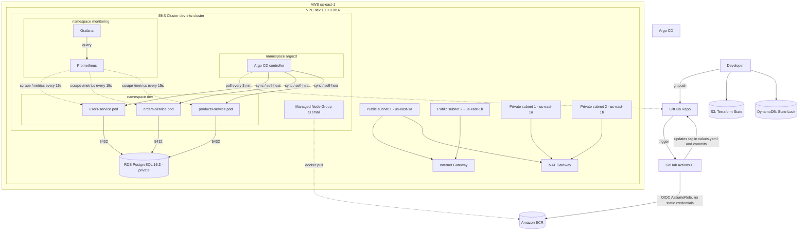

# AWS infrastructure for Kubernetes microservices

A hands-on, end-to-end DevOps practice project: AWS infrastructure provisioned with Terraform, three FastAPI microservices containerized with Docker, packaged with Helm, deployed to Amazon EKS, wired into a full CI/CD pipeline with GitHub Actions (OIDC) and Argo CD (GitOps), and observed with Prometheus + Grafana.

This README documents the full history of the project (Phases 1-4), including the exact commands used at each step, so it can be rebuilt from scratch or used as a reference.

## Project status

| Phase | Status | Contents |
|---|---|---|
| **Phase 1 — Infrastructure** | Complete | VPC, ECR, EKS, RDS, remote S3+DynamoDB backend, GitHub OIDC |
| **Phase 2 — Applications** | Complete | 3 microservices (FastAPI), multi-stage Docker, Helm charts |
| **Phase 3 — CI/CD and GitOps** | Complete | GitHub Actions (OIDC) + Argo CD with auto-sync and self-heal |
| **Phase 4 — Observability** | Complete | kube-prometheus-stack (Prometheus + Grafana), app-level metrics |
| **Phase 5 — Security** | Pending | Network Policies, Secrets Manager, Ingress + TLS |

## Architecture



### CI/CD and GitOps flow

The CI pipeline never touches the cluster directly:

1. Code push to `apps/<service>/` on the `master` branch.
2. GitHub Actions authenticates to AWS via OIDC (no static credentials), builds the Docker image, pushes it to ECR tagged with `github.sha`, updates the corresponding `values.yaml`, and commits that change back to the repo.
3. Argo CD, running inside the EKS cluster, detects the change in Git and pulls the new version into the `dev` namespace.
4. Auto-sync + self-heal: any manual drift on the cluster is detected and reverted automatically.

```
git push (code)
   -> GitHub Actions: build + push to ECR (auth via OIDC)
   -> GitHub Actions: update values.yaml + commit
   -> Argo CD detects the change in Git
   -> Argo CD deploys to EKS (dev namespace)
```

---

## Phase 1 — Infrastructure (Terraform)

### Repository layout for Terraform

```
terraform/
├── environments/
│   └── dev/
│       ├── backend.tf
│       ├── main.tf
│       ├── outputs.tf
│       └── variables.tf
└── modules/
    ├── vpc/
    ├── ecr/
    ├── eks/
    ├── rds/
    └── github-oidc/
```

### VPC module

VPC `10.0.0.0/16`, two public and two private subnets across `us-east-1a`/`us-east-1b`, one Internet Gateway, one NAT Gateway (single-AZ, cost decision), public/private route tables. Exposes `vpc_id`, `public_subnets_ids`, `private_subnets_ids`.

### ECR module

Three repositories created with `for_each`, one per microservice (`users-service`, `orders-service`, `products-service`), with `image_tag_mutability = "IMMUTABLE"` and `scan_on_push = true`.

### EKS module

- Two IAM roles: one for the control plane (`AmazonEKSClusterPolicy`) and one for the node group (`AmazonEKSWorkerNodePolicy`, `AmazonEKS_CNI_Policy`, `AmazonEC2ContainerRegistryReadOnly`).
- Cluster `dev-eks-cluster`, Kubernetes version `1.30`.
- Managed node group, instance type `t3.small` (upgraded from `t3.micro`; on `t3.micro` the pods-per-ENI limit made Argo CD's pods get stuck `Pending`), `desired_size = 3`, `min = 1`, `max = 4`.

### RDS module

DB subnet group + security group (port `5432` only from the VPC CIDR) + `aws_db_instance` PostgreSQL `16.3`, `db.t3.micro`, 20 GiB `gp3`, `publicly_accessible = false`, `skip_final_snapshot = true` (fine for a lab, not for production).

### github-oidc module

Creates an `aws_iam_openid_connect_provider` trusting `token.actions.githubusercontent.com`, and an `aws_iam_role` that GitHub Actions can assume via `AssumeRoleWithWebIdentity`, scoped to this specific repository. Only grants ECR push permissions (least privilege — this role can never touch EKS, RDS, or VPC).

Important lesson learned: GitHub's OIDC `sub` claim format changed to include immutable numeric IDs. The trust condition must match the real format, for example:

```
repo:<github-username>@<user-id>/<repo-name>@<repo-id>:environment:dev
```

You can inspect the real value your workflow receives by temporarily adding a debug step that fetches and decodes the OIDC token (see "Troubleshooting notes" below).

### Backend (remote state)

State lives in S3 with locking via DynamoDB. The bucket and table are **not** managed by Terraform (avoids the chicken-and-egg problem) and must be created manually first:

```bash
aws s3api create-bucket \
  --bucket my-project-tf-state-us-east-1 \
  --region us-east-1

aws s3api put-bucket-versioning \
  --bucket my-project-tf-state-us-east-1 \
  --versioning-configuration Status=Enabled

aws dynamodb create-table \
  --table-name terraform-ha-dev-locks \
  --attribute-definitions AttributeName=LockID,AttributeType=S \
  --key-schema AttributeName=LockID,KeyType=HASH \
  --billing-mode PAY_PER_REQUEST \
  --region us-east-1
```

`terraform/environments/dev/backend.tf`:

```hcl
terraform {
  backend "s3" {
    bucket         = "my-project-tf-state-us-east-1"
    key            = "dev/terraform.tfstate"
    region         = "us-east-1"
    dynamodb_table = "terraform-ha-dev-locks"
    encrypt        = true
  }
}
```

### Deploy the infrastructure

```bash
cd terraform/environments/dev
terraform init
terraform fmt -recursive ../../
terraform validate
terraform plan -var="db_password=REPLACE_WITH_A_SECRET"
terraform apply
```

`db_password` is a sensitive variable with no default on purpose — never hardcode it. Pass it via `-var`, a local `.tfvars` file excluded from Git, or an environment variable:

```bash
export TF_VAR_db_password="ReplaceWithASecureValue"
terraform plan
terraform apply
```

### Read outputs

```bash
terraform output
terraform output vpc_id
terraform output eks_cluster_endpoint
terraform output ecr_repository_urls
terraform output rds_endpoint
```

### Connect kubectl to the cluster

```bash
aws eks update-kubeconfig --region us-east-1 --name dev-eks-cluster
kubectl get nodes
```

Note: every time the cluster is destroyed and recreated, it gets a **new endpoint**, and this command must be run again or `kubectl` will fail with a DNS resolution error.

### Destroy the environment

```bash
cd terraform/environments/dev
terraform destroy
```

Warning: `terraform destroy` also deletes the ECR repositories, along with every image pushed to them. After recreating the infrastructure, all microservice images must be rebuilt and pushed again (or rely on the CI pipeline to do it).

### Terraform state lock troubleshooting

If a `plan`/`apply`/`destroy` is interrupted (closed terminal, lost connection), the state lock in DynamoDB can be left stuck:

```bash
terraform force-unlock <LOCK_ID>
```

The `<LOCK_ID>` is shown in the full error message when a locked operation is attempted.

---

## Phase 2 — Applications (Docker + Helm)

### Microservices

Three independent FastAPI services under `apps/`: `users-service`, `orders-service`, `products-service`. Each exposes `/`, `/health` (used by Kubernetes probes), and a domain endpoint (`/users`, `/orders`, `/products`).

Local run (optional, useful while developing):

```bash
cd apps/users-service
python -m venv venv
source venv/Scripts/activate   # Git Bash on Windows; venv/bin/activate on Linux/Mac
pip install -r requirements.txt
uvicorn app.main:app --reload --port 8000
```

### Dockerfile (multi-stage, non-root)

Each service has a Dockerfile with two stages: a `builder` stage that installs dependencies with `pip install --user`, and a slim runtime stage (`python:3.12-slim`) that copies only what's needed and runs as a non-root user.

Build and test locally:

```bash
cd apps/users-service
docker build -t users-service:local .
docker run -p 8000:8000 users-service:local
curl http://localhost:8000/
```

### Push an image to ECR manually (only needed outside of CI, e.g. right after recreating the infra)

```bash
aws ecr get-login-password --region us-east-1 | \
  docker login --username AWS --password-stdin <ACCOUNT_ID>.dkr.ecr.us-east-1.amazonaws.com

docker tag users-service:local <ACCOUNT_ID>.dkr.ecr.us-east-1.amazonaws.com/dev-users-service:v1
docker push <ACCOUNT_ID>.dkr.ecr.us-east-1.amazonaws.com/dev-users-service:v1
```

### Helm charts

An umbrella chart (`helm/microservices`) with one subchart per service, each containing a `Deployment` (image, replicas, resources, `livenessProbe`/`readinessProbe` against `/health`) and a `ClusterIP` `Service`.

Important detail learned the hard way: a `Service`'s `metadata.labels` and its `spec.selector` are two different things that happen to share the same key name (`app`). Prometheus' `ServiceMonitor` matches against `metadata.labels`, not `spec.selector` — see the observability section below.

```yaml
apiVersion: v1
kind: Service
metadata:
  name: users-service
  labels:
    app: users-service      # required for ServiceMonitor discovery
spec:
  selector:
    app: users-service       # routes traffic to pods, unrelated to the label above
  ports:
    - name: http              # must be named for ServiceMonitor to reference it
      port: 80
      targetPort: 8000
  type: ClusterIP
```

Manual Helm operations (not normally needed once Argo CD is managing the app — see Phase 3):

```bash
cd helm/microservices
helm dependency update
helm template .                 # render locally to check syntax, no cluster needed
helm install microservices . --namespace dev --create-namespace
helm upgrade microservices . -n dev
```

---

## Phase 3 — CI/CD and GitOps

### GitHub Actions workflows

One workflow per microservice under `.github/workflows/`, triggered on push to `master`/`feature/*` touching `apps/<service>/**`, or manually via `workflow_dispatch`. Each workflow:

1. Authenticates to AWS via OIDC using `aws-actions/configure-aws-credentials`, assuming the role stored in the `AWS_ROLE_ARN` secret (scoped to a GitHub **Environment** named `dev`, not a plain repository secret).
2. Builds and pushes the Docker image to ECR, tagged with `github.sha`.
3. Updates the image tag in the corresponding Helm `values.yaml`.
4. Commits and pushes that change back to `master` using the `github-actions[bot]` identity.

Required job permissions:

```yaml
permissions:
  contents: write   # needed because the workflow commits back to the repo
  id-token: write   # needed to request the OIDC token
```

### Argo CD

Installed inside the cluster, in its own namespace:

```bash
kubectl create namespace argocd
kubectl apply -n argocd -f https://raw.githubusercontent.com/argoproj/argo-cd/stable/manifests/install.yaml
kubectl get pods -n argocd
```

Access the UI:

```bash
kubectl port-forward svc/argocd-server -n argocd 8090:443
kubectl -n argocd get secret argocd-initial-admin-secret -o jsonpath="{.data.password}" | base64 -d
```

Open `https://localhost:8090` (user `admin`).

The `Application` resource is declarative and lives in Git (`argocd-apps/microservices-app.yaml`):

```yaml
apiVersion: argoproj.io/v1alpha1
kind: Application
metadata:
  name: microservices-app
  namespace: argocd
spec:
  project: default
  source:
    repoURL: https://github.com/<github-username>/k8s-microservices-terraform.git
    targetRevision: master
    path: helm/microservices
  destination:
    server: https://kubernetes.default.svc
    namespace: dev
  syncPolicy:
    automated:
      prune: true
      selfHeal: true
    syncOptions:
      - CreateNamespace=true
```

```bash
kubectl apply -f argocd-apps/microservices-app.yaml
kubectl get application microservices-app -n argocd
```

Force a manual sync instead of waiting for the ~3 minute poll interval:

```bash
kubectl patch application microservices-app -n argocd --type merge -p '{"operation": {"sync": {}}}'
```

(or use the **SYNC** button in the UI)

---

## Phase 4 — Observability (Prometheus + Grafana)

### Install kube-prometheus-stack

```bash
helm repo add prometheus-community https://prometheus-community.github.io/helm-charts
helm repo update
kubectl create namespace monitoring

helm install monitoring prometheus-community/kube-prometheus-stack \
  --namespace monitoring \
  --set prometheus.prometheusSpec.retention=6h \
  --set prometheus.prometheusSpec.resources.requests.memory=256Mi \
  --set prometheus.prometheusSpec.resources.limits.memory=512Mi \
  --set grafana.resources.requests.memory=128Mi \
  --set grafana.resources.limits.memory=256Mi \
  --set alertmanager.enabled=false

kubectl get pods -n monitoring
```

### Access Grafana and Prometheus

```bash
kubectl port-forward svc/monitoring-grafana -n monitoring 3000:80
kubectl get secret monitoring-grafana -n monitoring -o jsonpath="{.data.admin-password}" | base64 -d
```

```bash
kubectl port-forward svc/monitoring-kube-prometheus-prometheus -n monitoring 9090:9090
```

### Instrumenting the microservices

Each FastAPI app exposes `/metrics` using `prometheus-fastapi-instrumentator`:

```python
from fastapi import FastAPI
from prometheus_fastapi_instrumentator import Instrumentator

app = FastAPI(title="Users Service")
Instrumentator().instrument(app).expose(app)
```

Added to `requirements.txt`:

```
prometheus-fastapi-instrumentator==7.0.0
```

### ServiceMonitor per microservice

`helm/microservices/charts/<service>/templates/servicemonitor.yaml`:

```yaml
apiVersion: monitoring.coreos.com/v1
kind: ServiceMonitor
metadata:
  name: users-service
  namespace: dev
  labels:
    release: monitoring   # must match the Helm release name of kube-prometheus-stack
spec:
  selector:
    matchLabels:
      app: users-service   # must match Service metadata.labels, not spec.selector
  endpoints:
    - port: http            # must match the named port in the Service
      path: /metrics
      interval: 15s
```

### Verifying that Prometheus is actually scraping the services

```bash
curl -s http://localhost:9090/api/v1/targets?state=active | grep -o '"job":"serviceMonitor/dev/[^"]*"'
curl -s http://localhost:9090/api/v1/targets?state=dropped | grep -o '"job":"serviceMonitor/dev/[^"]*"'
curl -s --data-urlencode 'query=http_requests_total{job=~"serviceMonitor/dev/.*"}' http://localhost:9090/api/v1/query
```

If a target shows up under `dropped` instead of `active`, inspect the generated scrape config directly:

```bash
kubectl get secret -n monitoring prometheus-monitoring-kube-prometheus-prometheus \
  -o jsonpath="{.data.prometheus\.yaml\.gz}" | base64 -d | gunzip > /tmp/prom-config.yaml
grep -n "job_name: serviceMonitor/dev/users-service/0" /tmp/prom-config.yaml
sed -n '<line>,+80p' /tmp/prom-config.yaml
```

Look for `action: keep` rules referencing `__meta_kubernetes_service_label_app` — this is what requires the `app` label on the Service's own `metadata.labels`, not just its `spec.selector`.

### Example query in Grafana Explore

```
rate(http_requests_total{job=~"serviceMonitor/dev/.*"}[5m])
```

---

## Troubleshooting notes (real issues hit during this project)

- **Terraform: reference to undeclared resource** — usually a renamed resource whose references elsewhere in the code were not updated. Search the whole file for the old name after any rename.
- **Terraform: subnet/VPC ID not found on `apply`** — happens after `terraform destroy` + `apply` on the VPC module recreates it with new IDs. Fixed by wiring modules together through outputs (`module.vpc.private_subnets_ids`) instead of hardcoding IDs.
- **EKS: invalid Kubernetes version** — always check currently supported EKS versions before setting `version` in the `aws_eks_cluster` resource.
- **EKS node group stuck `Pending`** — on `t3.micro`, the AWS VPC CNI pods-per-ENI limit (around 4 pods per node, including system pods) is too low for a full stack (app pods + Argo CD + Prometheus). Fixed by moving to `t3.small` and/or increasing `desired_size`.
- **`kubectl` "no such host" after recreating EKS** — the cluster gets a new endpoint every time it's recreated; re-run `aws eks update-kubeconfig`.
- **GitHub Actions OIDC: `Not authorized to perform sts:AssumeRoleWithWebIdentity`** — the `sub` claim format changed to include immutable numeric IDs (`repo:user@id/repo@id:environment:dev`). Debug by temporarily fetching and decoding the actual OIDC token inside the workflow.
- **Prometheus target in `droppedTargets`** — check the Service's own `metadata.labels`, not just `spec.selector`; `ServiceMonitor.selector.matchLabels` matches against Service labels.
- **`/metrics` returns 404** — the instrumentation code (`Instrumentator().instrument(app).expose(app)`) was only added to one service; it must be added to every service individually, since each is an independent codebase.

---

## Security and operations

- No passwords, tokens, or AWS credentials are stored in the repository.
- GitHub Actions authenticates to AWS via OIDC, with no long-lived credentials, scoped to a role with least-privilege ECR-only permissions.
- RDS is not publicly accessible; it only accepts traffic from inside the VPC.
- ECR repositories have immutable tags and vulnerability scanning on every push.
- Containers run as a non-root user.
- Pending (Phase 5): Kubernetes Secrets / AWS Secrets Manager for RDS credentials, Network Policies, Ingress with TLS.

## Known limitations

1. The NAT Gateway is in a single Availability Zone (cost decision).
2. RDS does not use Multi-AZ and does not have backups/retention explicitly configured; `skip_final_snapshot = true`.
3. The microservices return hardcoded sample data; there is no real connection to RDS yet.
4. There is no Ingress or internet-facing load balancer — current access is only via `port-forward`.
5. There are no Network Policies or traffic segmentation between pods.
6. Alertmanager is disabled to save resources on small nodes.

## Repository structure

```
.
├── .github/
│   └── workflows/
│       ├── users-service-build.yml
│       ├── orders-service-build.yml
│       └── products-service-build.yml
├── apps/
│   ├── users-service/
│   ├── orders-service/
│   └── products-service/
│       ├── app/main.py
│       ├── Dockerfile
│       ├── requirements.txt
│       └── .dockerignore
├── argocd-apps/
│   └── microservices-app.yaml
├── helm/
│   └── microservices/
│       ├── Chart.yaml
│       ├── values.yaml
│       └── charts/
│           ├── users-service/
│           ├── orders-service/
│           └── products-service/
│               ├── Chart.yaml
│               ├── values.yaml
│               └── templates/
│                   ├── deployment.yaml
│                   ├── service.yaml
│                   └── servicemonitor.yaml
├── terraform/
│   ├── environments/
│   │   └── dev/
│   │       ├── backend.tf
│   │       ├── main.tf
│   │       ├── outputs.tf
│   │       └── variables.tf
│   └── modules/
│       ├── vpc/
│       ├── ecr/
│       ├── eks/
│       ├── rds/
│       └── github-oidc/
├── .gitignore
└── README.md
```

## Requirements

- Terraform, AWS CLI, `kubectl`, Helm, and Docker installed.
- AWS credentials with sufficient permissions for VPC, IAM, EKS, ECR, RDS, S3, and DynamoDB.
- An S3 bucket and a DynamoDB table created before `terraform init` (see Phase 1 above).

## Next steps (Phase 5)

- Connect the microservices to RDS for real, with credentials via Kubernetes Secrets or External Secrets Operator + AWS Secrets Manager.
- Add an Ingress Controller (AWS ALB) + cert-manager for HTTPS.
- Network Policies to restrict traffic between pods.
- IaC scanning (`tfsec`/`checkov`) and Kubernetes manifest scanning in the CI pipeline.
- Enable Alertmanager and define basic alert rules.

## Author

**Roberto Palacios** — [LinkedIn](https://www.linkedin.com/in/robpalacios1)
