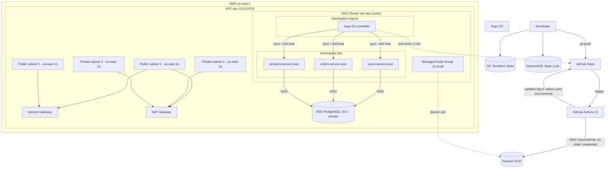

# AWS infrastructure for Kubernetes microservices

Microservices platform on AWS EKS, built as an end-to-end DevOps practice project: infrastructure as code, containers, Kubernetes, CI/CD, and GitOps.
 
The project provisions the network, image repositories, Kubernetes cluster, and a managed PostgreSQL database through reusable Terraform modules, deploys three FastAPI microservices packaged with Helm, and automates the full continuous delivery cycle with GitHub Actions (CI) and Argo CD (CD/GitOps).
 
## Current project status
 
| Phase | Status | Contents |
|---|---|---|
| **Phase 1 — Infrastructure** | Complete | VPC, ECR, EKS, RDS, remote S3+DynamoDB backend |
| **Phase 2 — Applications** | Complete | 3 microservices (FastAPI), multi-stage Docker, Helm charts |
| **Phase 3 — CI/CD and GitOps** | Complete | GitHub Actions (OIDC) + Argo CD with auto-sync and self-heal |
| **Phase 4 — Observability** | Pending | Prometheus, Grafana |
| **Phase 5 — Security** | Pending | Network Policies, Secrets Manager, Ingress + TLS |
 
## Architecture
 

 
### CI/CD and GitOps flow
 
This is the core of the project: the CI pipeline never touches the cluster directly. Instead:
 
1. Code push to `apps/<service>/` on the `master` branch.
2. GitHub Actions (CI) triggers automatically:
   - Authenticates against AWS using OIDC (no Access Keys or static credentials stored) by assuming an IAM Role federated with GitHub.
   - Builds the Docker image and pushes it to ECR, tagged with the commit hash (`github.sha`).
   - Automatically updates the corresponding Helm chart's `values.yaml` with the new tag.
   - Commits and pushes that change back to the repository (identity `github-actions[bot]`).
3. Argo CD, running inside the EKS cluster, detects the change in Git (polling every ~3 min or manual sync) and pulls the new version, applying it automatically to the `dev` namespace.
4. Auto-sync + self-heal: any manual change made directly on the cluster (`kubectl edit`, `kubectl scale`, etc.) is detected as a drift from the state declared in Git and automatically reverted by Argo CD.
```
git push (code)
   -> GitHub Actions: build + push to ECR (auth via OIDC)
   -> GitHub Actions: update values.yaml + commit
   -> Argo CD detects the change in Git
   -> Argo CD deploys to EKS (dev namespace)
```
 
## Implemented components
 
### Terraform — Infrastructure (Phase 1)
 
| Module | Main resources | Integration |
|---|---|---|
| `vpc` | VPC, 4 subnets (2 public / 2 private across 2 AZs), Internet Gateway, NAT Gateway, route tables | Exposes `vpc_id`, `public_subnets_ids`, `private_subnets_ids` |
| `ecr` | 3 ECR repositories (`for_each`), immutable tags, scan-on-push | Exposes `repository_urls`, `repository_arns` |
| `eks` | IAM roles (cluster and nodes), EKS cluster, managed node group | Consumes `private_subnet_ids` from `vpc` |
| `rds` | DB subnet group, security group, PostgreSQL instance | Consumes `vpc_id` and `private_subnet_ids` from `vpc` |
| `github-oidc` | OIDC Provider + IAM Role for GitHub Actions | Allows `AssumeRoleWithWebIdentity` only from this repo |
 
Configuration details:
 
- VPC: CIDR `10.0.0.0/16`, subnets in `us-east-1a`/`us-east-1b`, a single NAT Gateway (cost decision for a practice environment).
- ECR: `image_tag_mutability = "IMMUTABLE"` — every tag is immutable once published, enforcing per-version traceability.
- EKS: cluster `dev-eks-cluster`, Kubernetes version `1.30`. Node group on `t3.small` instances (upgraded from `t3.micro` due to the pods-per-ENI limit on very small instances), `desired_size = 3`, `min = 1`, `max = 4`.
- RDS: PostgreSQL `16.3`, `db.t3.micro`, 20 GiB `gp3`, `publicly_accessible = false`, security group allowing `5432` only from inside the VPC.
- Remote backend: state in S3 (`my-project-tf-state-us-east-1`, key `dev/terraform.tfstate`) with locking via DynamoDB (`terraform-ha-dev-locks`).
- OIDC: the IAM Role assumed by GitHub Actions trusts specifically the `sub` claim of this repository (format using immutable numeric user/repo IDs + `environment:dev`), with no long-lived credentials.
### Applications (Phase 2)
 
Three microservices in Python (FastAPI), each with:
 
- `/`, `/health` (used by Kubernetes probes), and a domain endpoint (`/users`, `/orders`, `/products`).
- Multi-stage `Dockerfile`: dependency build separated from runtime, final image based on `python:3.12-slim`, non-root user (`appuser`) for security.
- Image published to its corresponding ECR repository.
### Helm (Phase 2)
 
Umbrella chart `helm/microservices` with one subchart per service (`users-service`, `orders-service`, `products-service`), each with:
 
- Parameterized `Deployment` (image, replicas, resources, `livenessProbe`/`readinessProbe` against `/health`).
- `ClusterIP` `Service` (internal cluster use; not yet exposed to the internet).
- `resources.requests`/`limits` tuned to run on small instances.
### CI/CD (Phase 3)
 
- GitHub Actions: one workflow per microservice (`.github/workflows/<service>-build.yml`), triggered by changes to `apps/<service>/**` on `master`/`feature/*`, or manually via `workflow_dispatch`.
- OIDC authentication: no `AWS_ACCESS_KEY_ID`/`AWS_SECRET_ACCESS_KEY`. The `AWS_ROLE_ARN` secret (scoped to the `dev` GitHub Environment) is the only configuration value needed.
- Automatic manifest updates: the pipeline itself commits the new image tag into the corresponding `values.yaml` — this is what signals Argo CD to deploy.
- Argo CD: installed in the `argocd` namespace of the cluster, manages a declarative `Application` (`argocd-apps/microservices-app.yaml`) pointing to `helm/microservices` on the `master` branch, with `syncPolicy.automated` (`prune` + `selfHeal`) enabled.
## Repository structure
 
```
.
├── .github/
│   └── workflows/
│       ├── users-service-build.yml
│       ├── orders-service-build.yml
│       └── products-service-build.yml
├── apps/
│   ├── users-service/
│   ├── orders-service/
│   └── products-service/
│       ├── app/main.py
│       ├── Dockerfile
│       ├── requirements.txt
│       └── .dockerignore
├── argocd-apps/
│   └── microservices-app.yaml
├── helm/
│   └── microservices/
│       ├── Chart.yaml
│       ├── values.yaml
│       └── charts/
│           ├── users-service/
│           ├── orders-service/
│           └── products-service/
│               ├── Chart.yaml
│               ├── values.yaml
│               └── templates/
│                   ├── deployment.yaml
│                   └── service.yaml
├── terraform/
│   ├── environments/
│   │   └── dev/
│   │       ├── backend.tf
│   │       ├── main.tf
│   │       ├── outputs.tf
│   │       └── variables.tf
│   └── modules/
│       ├── vpc/
│       ├── ecr/
│       ├── eks/
│       ├── rds/
│       └── github-oidc/
├── .gitignore
└── README.md
```
 
## Requirements
 
- Terraform, AWS CLI, `kubectl`, and Helm installed.
- AWS credentials with sufficient permissions for VPC, IAM, EKS, ECR, RDS, S3, and DynamoDB.
- An S3 bucket and a DynamoDB table created before `terraform init` (not managed by this code, to avoid the "chicken and egg" problem of the backend itself):
  - Bucket: `my-project-tf-state-us-east-1`
  - Table: `terraform-ha-dev-locks`
  - Region: `us-east-1`
## Usage
 
All Terraform commands are run from `terraform/environments/dev`.
 
### Deploy the infrastructure
 
```bash
cd terraform/environments/dev
terraform init
terraform plan -var="db_password=REPLACE_WITH_A_SECRET"
terraform apply
```
 
### Connect kubectl to the cluster
 
```bash
aws eks update-kubeconfig --region us-east-1 --name dev-eks-cluster
kubectl get nodes
```
 
### Deploy Argo CD (one time only)
 
```bash
kubectl create namespace argocd
kubectl apply -n argocd -f https://raw.githubusercontent.com/argoproj/argo-cd/stable/manifests/install.yaml
kubectl apply -f argocd-apps/microservices-app.yaml
```
 
From here on, any change under `apps/` that goes through the CI pipeline deploys itself — no manual `helm install`/`helm upgrade` is required.
 
### Access the Argo CD UI
 
```bash
kubectl port-forward svc/argocd-server -n argocd 8090:443
kubectl -n argocd get secret argocd-initial-admin-secret -o jsonpath="{.data.password}" | base64 -d
```
 
Open `https://localhost:8090` (user `admin`).
 
### Test a microservice locally
 
```bash
kubectl port-forward svc/users-service -n dev 8000:80
```
 
Then open `http://127.0.0.1:8000/`. Same pattern applies to `orders-service` and `products-service`.
 
### Destroy the environment
 
```bash
cd terraform/environments/dev
terraform destroy
```
 
This configuration deletes RDS without a final snapshot (`skip_final_snapshot = true`) — appropriate for a practice environment, do not use as a production template without changing that policy.
 
## Security and operations
 
- No passwords, tokens, or AWS credentials are stored in the repository.
- GitHub Actions authenticates to AWS via OIDC, with no long-lived credentials.
- RDS is not publicly accessible; it only accepts traffic from inside the VPC.
- ECR repositories have immutable tags and vulnerability scanning on every push.
- Containers run as a non-root user.
- Pending (Phase 5): Kubernetes Secrets / AWS Secrets Manager for RDS credentials, Network Policies, Ingress with TLS.
## Known limitations
 
1. The NAT Gateway is in a single Availability Zone (cost decision) — an outage in `us-east-1a` affects internet egress for both private subnets.
2. RDS does not use Multi-AZ and does not have backups/retention explicitly configured.
3. The microservices return hardcoded sample data; there is no real connection to RDS yet.
4. There is no Ingress or internet-facing load balancer — current access is only via `port-forward`.
5. There are no Network Policies or traffic segmentation between pods.
6. There is no observability stack (metrics, logs, alerts) yet.
## Next steps (Phase 4 and 5)
 
- Install Prometheus + Grafana (`kube-prometheus-stack`) for metrics and dashboards.
- Centralize logs (Loki or EFK).
- Connect the microservices to RDS for real, with credentials via Kubernetes Secrets or External Secrets Operator + AWS Secrets Manager.
- Add an Ingress Controller (AWS ALB) + cert-manager for HTTPS.
- Network Policies to restrict traffic between pods.
- IaC scanning (`tfsec`/`checkov`) and Kubernetes manifest scanning in the CI pipeline.
## Author
 
**Roberto Palacios** — [LinkedIn](https://www.linkedin.com/in/robpalacios1)